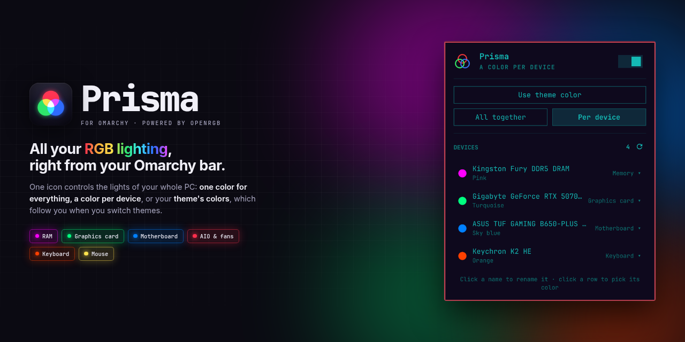
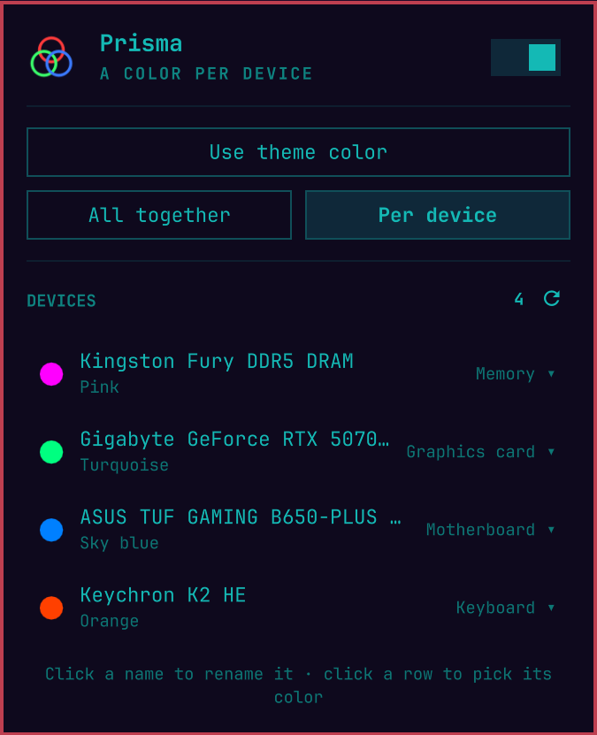
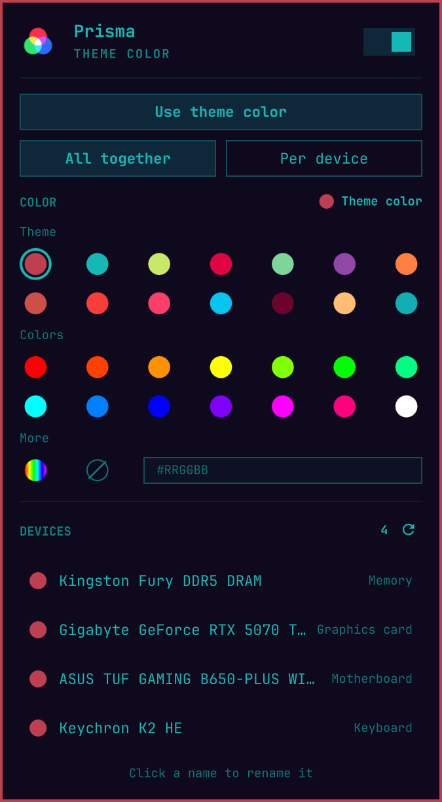
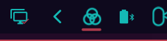

<p align="center">
  
</p>

<p align="center">
  <a href="https://omarchyplugins.com/plugin.html?id=diogocezar.prisma"></a>
  
  <a href="https://openrgb.org/"></a>
  <a href="LICENSE"></a>
</p>

<p align="center">
  <a href="#install">Install</a> ·
  <a href="#using-prisma">Using Prisma</a> ·
  <a href="#settings">Settings</a> ·
  <a href="#troubleshooting">Troubleshooting</a> ·
  <a href="#uninstall">Uninstall</a>
</p>

---

**Prisma is a bar widget that controls the RGB lighting of your whole PC**
(motherboard, RAM, graphics card, AIO and fans, keyboard, mouse) from one icon
in your Omarchy bar. Paint everything in one color, give every device its own,
or follow your Omarchy theme, so the lights change when you switch themes.

Every one of those parts ships with its own vendor app, and none of them run
on Linux. Prisma talks to all of them through [OpenRGB](https://openrgb.org/).

<table>
  <tr>
    <td align="center" width="50%"></td>
    <td align="center" width="50%"></td>
  </tr>
  <tr>
    <td align="center"><b>Per device</b>: each part in its own color</td>
    <td align="center"><b>All together</b>: one color, from your theme or any hex</td>
  </tr>
</table>

## Features

| | |
|---|---|
| 🎨 **Follows your theme** | Pick the theme's accent, text or any palette color. Prisma stores the *reference*, not the hex, so `omarchy theme set` recolors your whole desk. |
| 🧩 **All together or one by one** | One color for every device, or a color per device. A device without its own color follows the shared one. |
| 🌈 **Any color, plus effects** | Theme colors, fourteen ready-made colors, a `#RRGGBB` field for anything else, a rainbow cycle and off. |
| 🏷️ **Rename devices** | "ASUS TUF GAMING B650-PLUS WIFI" can just be "Motherboard". |
| 🧠 **Smart per device** | Each device gets the best mode it supports (Static, Direct, Solid Color… or Rainbow, Spectrum Cycle…), so you never pick modes by hand. |
| 🔁 **Survives reboots** | Your choice lives in the shell config and is applied again every time the shell starts. |
| 🖱️ **Quick toggle** | **Middle-click** the bar icon to turn the lights off and on without opening the panel. |
| 🌍 **Multilingual** | English, Português, Español, Français and Deutsch, following your system locale. |

## Install

Prisma drives your hardware through [OpenRGB](https://openrgb.org/), a
separate package, so installing takes two parts: OpenRGB first, then the
plugin. It takes about five minutes, one reboot included.

### 1. Install OpenRGB

OpenRGB is in the official Arch repos:

```bash
sudo pacman -S --needed openrgb
```

Besides the program, the package installs the **udev rules** that let your
user talk to RGB controllers without root, and loads the **`i2c-dev`** kernel
module at boot, which RAM, motherboard and GPU lighting need.

### 2. Reboot once

Reboot so the udev rules and `i2c-dev` take effect.

<details>
<summary>Can't reboot right now?</summary>

```bash
sudo modprobe i2c-dev
sudo udevadm control --reload && sudo udevadm trigger
```

Then unplug and plug back any USB device (keyboard, mouse, fan hub).
</details>

### 3. Check that OpenRGB sees your hardware

```bash
openrgb --list-devices
```

You should see your devices listed with their modes. **If a device is missing
here, Prisma can't see it either**: see [Troubleshooting](#troubleshooting)
before going on. OpenRGB keeps a list of
[supported devices](https://openrgb.org/devices.html).

### 4. Install Prisma

```bash
omarchy plugin add https://github.com/diogocezar/omarchy-prisma.git --enable
```

The Prisma icon ()
lands in the right section of your bar, and your lights switch to your theme's
accent color. That's it.

Prefer it somewhere else? Move it with:

```bash
omarchy bar move diogocezar.prisma --section left     # or center, right
```

> **Requirements at a glance:** Omarchy with the Quattro shell, `openrgb`,
> `python3` and a systemd user session. The last two ship with every Omarchy
> install. No root is needed once OpenRGB is installed, and Prisma installs
> nothing else on your system.

## Using Prisma

**Click** the icon to open the panel.

1. **Pick a look** for every device: a theme color, a ready-made color, a hex
   code in the `#RRGGBB` field, rainbow, or off.
2. Switch to **Per device** to color each device on its own. Click a device,
   then pick its look; **Same as all** puts it back on the shared color.
3. **Click a device name** to rename it. Clear the name to get the original
   back.
4. **Use theme color** puts every device back on the theme accent at once.

| Shortcut | What it does |
|---|---|
| **Middle-click** the icon | Lights off / on, without opening the panel |
| `←` / `→` in the panel | Switch between *All together* and *Per device* |
| `Esc` | Close the panel |
| **↻** next to *Devices* | Detect devices again (e.g. a wireless mouse that was asleep) |

The icon turns **red** when something is wrong; hover it or open the panel to
see the error.

## Settings

Everything above is also a widget setting, so you can change it from the bar
settings or with `omarchy bar set`:

| Key | Values | Default | What it does |
|---|---|---|---|
| `enabled` | `true`, `false` | `true` | Lighting on or off |
| `mode` | `all`, `each` | `all` | One color for every device, or one per device |
| `color` | `theme:accent`, `theme:color4`…, `ff4000`, `rainbow`, `off` | `theme:accent` | The shared look |
| `argbLeds` | `0`–`300` | `24` | LEDs per empty ARGB header (`0` leaves headers alone) |
| `language` | `auto`, `en`, `pt`, `es`, `fr`, `de` | `auto` | Panel language (`auto` follows the system locale) |

```bash
omarchy bar set diogocezar.prisma argbLeds 36 --json      # numbers and booleans need --json
omarchy bar set diogocezar.prisma language pt
```

## Update

```bash
omarchy plugin update diogocezar.prisma
```

## Uninstall

```bash
omarchy plugin remove diogocezar.prisma
systemctl --user stop prisma-openrgb 2>/dev/null   # if Prisma started its own server
rm -rf ~/.cache/prisma                             # optional: device cache
```

Your devices keep the last color they were given. OpenRGB stays installed; if
you don't need it anymore, remove it with `sudo pacman -Rns openrgb`.

## How it works

Prisma has two parts:

1. **A bar widget** (`src/Widget.qml`) that stores your choices in the shell
   config and resolves them to colors, reading the palette straight from the
   active theme's `colors.toml`.
2. **A small backend** (`src/prisma.py`) that turns those colors into one
   `openrgb` call for every device.

### The OpenRGB server

Some controllers (ASUS Aura, for one) go back to their default colors as soon
as the program talking to them exits. So Prisma always goes through a
long-running OpenRGB server, picking the first of:

1. **A server already running**: the OpenRGB app with its SDK server on, or
   the system service shipped with the package
   (`sudo systemctl enable --now openrgb`). Prisma uses it as is.
2. **A user unit named `openrgb.service`**, if you have one. Prisma starts it.
3. **Otherwise, its own server**, started as the transient user unit
   `prisma-openrgb`. Nothing is installed; it lasts until you log out, and
   Prisma starts it again when the shell comes back.

### Addressable (ARGB) headers

OpenRGB can't tell how many LEDs are on a strip or fan plugged into an
addressable header, so those zones often show up with **0 LEDs** and stay
dark. Prisma resizes every *empty* addressable zone to **24 LEDs** (enough for
common AIO fans) on each apply. Zones that already have a size are left
alone. Change the number, or set it to `0` to turn this off, with the
`argbLeds` [setting](#settings).

### Command line

The backend works on its own, handy for binds and scripts:

```bash
SRC=~/.config/omarchy/plugins/diogocezar.prisma/src
python3 $SRC/prisma.py list            # what OpenRGB sees, and each device's modes
python3 $SRC/prisma.py red             # also: a hex like ff4000, theme, rainbow, off
python3 $SRC/prisma.py rescan          # restart the server to pick up new devices
```

Commands run this way don't change the widget's settings, so the next change
in the panel (or the next shell start) applies the panel's choice again.

## Troubleshooting

<details>
<summary><b>The icon is red</b></summary>

Hover it, or open the panel: the error from OpenRGB is shown there. The most
common one is `openrgb is not installed`; go back to
[step 1](#1-install-openrgb).
</details>

<details>
<summary><b>A wireless mouse or headset is missing</b></summary>

The OpenRGB server only detects devices when it starts, and wireless devices
that are asleep don't answer. Move the device to wake it, then press **↻**
(detect again) next to *Devices* in the panel.

Detecting again restarts the server, so it only works on a server Prisma
manages. For the OpenRGB app or the system service, restart it yourself.
</details>

<details>
<summary><b>RAM or motherboard lighting is missing</b></summary>

Check that `i2c-dev` is loaded (`lsmod | grep i2c_dev`). On some Intel boards
the SMBus is blocked unless you add `acpi_enforce_resources=lax` to the kernel
command line; see OpenRGB's [SMBus guide](https://openrgb.org/udev.html).
</details>

<details>
<summary><b>Fans on a motherboard header stay dark</b></summary>

Raise `argbLeds` to the number of LEDs on your fans or strip:
`omarchy bar set diogocezar.prisma argbLeds 36 --json`.
</details>

<details>
<summary><b>A device ignores colors</b></summary>

Run `prisma.py list` (see [Command line](#command-line)) and look at its
modes. If none of them is a static-color mode Prisma knows, please
[open an issue](https://github.com/diogocezar/omarchy-prisma/issues) with that
output.
</details>

<details>
<summary><b>Logs</b></summary>

For the server Prisma started: `journalctl --user -u prisma-openrgb`.
</details>

## Credits

Built on [OpenRGB](https://gitlab.com/CalcProgrammer1/OpenRGB) by Adam Honse
and contributors, which does all of the actual hardware work. Prisma is an
independent project and isn't affiliated with OpenRGB.

## License

[MIT](LICENSE) © Diogo Cezar
